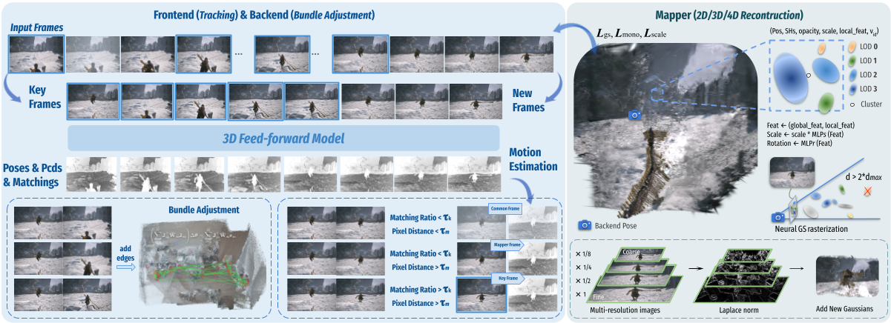

# M³: Dense Matching Meets Multi-View Foundation Models for Monocular Gaussian Splatting SLAM

[Kerui Ren](https://scholar.google.com/citations?user=5kW5apkAAAAJ), [Guanghao Li](https://scholar.google.com/citations?user=6nkKQDIAAAAJ), [Changjian Jiang](https://scholar.google.com/citations?user=V4miywEAAAAJ), [Yingxiang Xu](https://github.com/LeoX0808), [Tao Lu](https://scholar.google.com/citations?user=Ch28NiIAAAAJ), [Linning Xu](https://eveneveno.github.io/lnxu/), [Junting Dong](https://jtdong.com/), [Jiangmiao Pang](https://oceanpang.github.io/), [Mulin Yu†](https://scholar.google.com/citations?user=w0Od3hQAAAAJ), [Bo Dai†](https://daibo.info/)

## Overview

**Pipeline of M³.** Our framework consists of joint tracking and global optimization for pose estimation and a mapper for scene reconstruction. For monocular sequences, Pi3X processes retrieved historical keyframes and new frames in one inference to facilitate factor graph construction and keyframe selection. Following the Neural Gaussian and LOD architecture of ARTDECO, Gaussians are initialized via Laplacian norm and optimized jointly with camera poses.